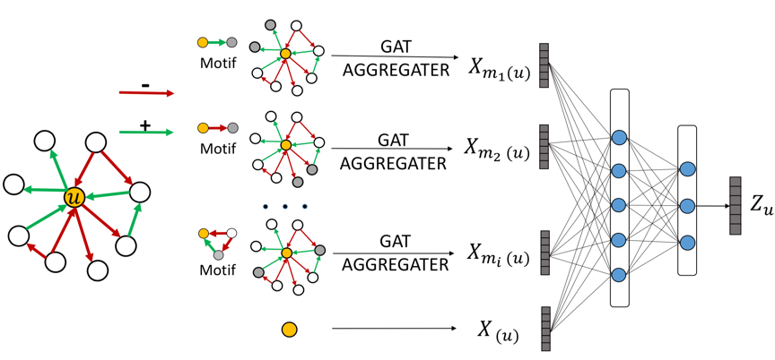

## Signed Graph Attention Networks

## Overview
This [paper](https://arxiv.org/abs/1906.10958) is accepted at ICANN2019.

<div align=center>
 
</div>

> We provide a Pytorch implementation of Signed Graph Attention Network, which incorporates graph motifs into GAT to capture two well-known theories in signed network research, i.e., balance theory and status theory.

## Requirements

The script has been tested running under Python 3.6.3, with the following packages installed (along with their dependencies):

```
pip install -r requirements.txt
```


## Parameters

```
parser.add_argument('--devices', type=str, default='cpu', help='Devices')
parser.add_argument('--seed', type=int, default=13, help='Random seed.')
parser.add_argument('--epochs', type=int, default=100, help='Number of epochs to train.')
parser.add_argument('--lr', type=float, default=0.0005, help='Initial learning rate.')
parser.add_argument('--weight_decay', type=float, default=0.0001, help='Weight decay (L2 loss on parameters).')
parser.add_argument('--dataset', default='bitcoin_alpha', help='Dataset')
parser.add_argument('--dim', type=int, default=20, help='Embedding Dimension')
parser.add_argument('--fea_dim', type=int, default=20, help='Feature Embedding Dimension')
parser.add_argument('--batch_size', type=int, default=500, help='Batch Size')
parser.add_argument('--dropout', type=float, default=0.0, help='Dropout k')
parser.add_argument('--k', default=1, help='Folder k')
```


## Run Example


Firstly, run ```python sigat.py``` get node embeddings, then run ```python logistic_function.py``` to get results.

```
pos_ratio: 0.9394377842083506
accuracy: 0.9466721785861927
f1_score: 0.9720476706392199
macro f1_score: 0.696786167158175
micro f1_score: 0.9466721785861927
auc score: 0.8879674998216545

```


## Cite
Please cite our paper if you use this code in your own work:

```
@article{huang2019signed,
  title={Signed Graph Attention Networks},
  author={Huang, Junjie and Shen, Huawei and Hou, Liang and Cheng, Xueqi},
  journal={arXiv preprint arXiv:1906.10958},
  year={2019}
}
```


## Acknowledgement

> Some codes adapted from [paper](https://dl.acm.org/citation.cfm?id=1772756)

