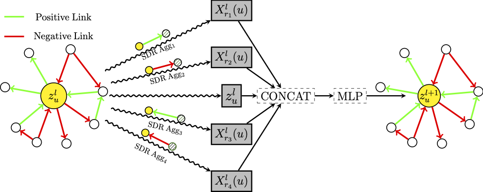

#  SDGNN: Learning Node Representation for Signed Directed Networks

## Abstract

In this paper, we propose a novel Signed Directed Graph Neural Networks model named SDGNN to learn node embeddings for signed directed networks. The proposed model simultaneously reconstructs link signs, link directions, and signed directed triangles.

## Overview
This [paper](https://arxiv.org/abs/1906.10958) is accepted at AAAI2021.

<div align=center>
 
</div>


> We provide a Pytorch implementation of SDGNN model.
> You can change different aggregator and other parameters to explore different architectures.

## Comparison of Different Model Architectures

| METHOD | SDGNN | [BESIDES](https://dl.acm.org/doi/abs/10.1145/3269206.3271738) | [SiGAT](https://link.springer.com/chapter/10.1007/978-3-030-30493-5_53) | [SGCN](https://ieeexplore.ieee.org/abstract/document/8594922/) |
| ------ | ----- | ------- | ----- | ---- |
| GNN Aggregator          | Y     | N       | Y     | Y    |
| Layer By Layer          | Y     | N       | N     | Y    |
| Direction Loss Function | Y     | Y       | N     | N    |
| Triangle Loss Function  | Y     | Y       | N     | N    |

## Run code

Run ```python sdgnn.py``` .py to get results.

```
pos_ratio: 0.9394377842083506
accuracy: 0.9470855725506407
f1_score: 0.9720950512317418
macro f1_score: 0.731067445934596
micro f1_score: 0.9470855725506407
auc score: 0.8810108997247847
```

## Some Notes

This code relies on Pytorch (>=1.0.1) due to the ```torch.spmm``` [api](https://pytorch.org/docs/1.0.1/sparse.html?highlight=spmm#torch.sparse.FloatTensor.spmm)

## Bibtex

```
@inproceedings{huangsdgnn,
  title={SDGNN: Learning Node Representation for Signed Directed Networks},
  author={Huang, Junjie and Shen, Huawei and Hou, Liang and Cheng, Xueqi},
  booktitle={AAAI},
  year={2021}
}
```

